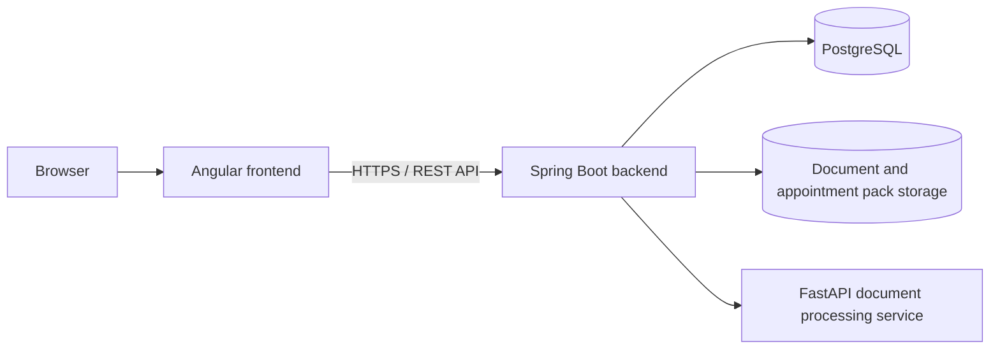

# The Appointment Pack Frontend

The Appointment Pack helps patients and carers organise healthcare information and prepare for appointments. It brings together patient details, appointments, medications, contacts, blood results, medical history, healthcare documents, care access, appointment packs, activity history and administrator analytics.

This repository contains the **Angular frontend**. It provides the browser interface for patients, carers and administrators and communicates with the Spring Boot backend through its REST API.

## Overview

The frontend provides the main user workflows for:

- registration, login, email verification, password reset and TOTP MFA.
- profile and patient record management.
- patient/carer invitations, permissions and patient selection.
- appointments, medications, contacts, blood results and medical history.
- appointment letter upload, extraction review and confirmation.
- consultation outcome letter de-identification review and summary review.
- appointment pack generation, preview and download.
- patient activity history.
- administrator analytics.

Angular handles presentation, routing, forms and browser state. Spring Boot remains responsible for authentication checks, permissions, workflow rules and stored application data.

## Architecture



The browser communicates only with Spring Boot:

```text
Browser
-> Angular frontend
-> Spring Boot backend
```

The FastAPI service, PostgreSQL and OpenAI are reached through server-side components. They are not browser integrations.

Frontend permission checks are used to guide navigation and available actions. Spring Boot performs the actual security checks before returning or changing patient data.

The healthcare document workflows are shown to the user as separate review paths.

**Appointment letter**

```text
upload
-> local extraction and appointment letter parsing through Spring Boot and FastAPI
-> editable appointment suggestions
-> human confirmation
-> appointment saved by Spring Boot
```

**Consultation outcome letter**

```text
upload
-> local extraction and de-identification through Spring Boot and FastAPI
-> human privacy review and editing
-> explicit approval
-> approved de-identified text
-> OpenAI summarisation through FastAPI
-> human summary review
-> medical history if accepted
```

Original healthcare documents are not sent to OpenAI.

## Main Features

### Accounts and access

- Registration, email verification and login.
- Password reset and password change.
- TOTP MFA setup, login and disablement.
- Patient profiles and patient records.
- Patient/carer invitations and relationship management.
- Permission-aware navigation and actions.
- Selected patient context for users who can access more than one patient record.

### Patient information

- Appointments.
- Medications.
- Healthcare contacts.
- Emergency contacts.
- Blood tests and results.
- Medical history.
- Patient activity history.

### Healthcare documents

- PDF, JPEG and PNG upload.
- Appointment letter extraction review with editable appointment details.
- Consultation outcome letter de-identification review with explicit approval before summarisation.
- Consultation outcome letter summary review before it can be added to medical history.
- Clear handling of processing failures and retry states.

### Appointment packs and administration

- Appointment pack creation from selected patient information.
- Appointment pack detail, PDF preview, download and archive.
- Administrator analytics and operational event views.

## Technology

| Area | Technology |
|---|---|
| Framework | Angular 22.0.6 |
| Language | TypeScript 6.0.3 |
| Async data | RxJS 7.8.2 |
| Forms | Angular reactive forms |
| Shared state | Angular signals and services |
| Styling | Tailwind CSS 4.3.2 |
| MFA QR rendering | `ng-qrcode` 22.0.0 |
| Testing | Vitest 4.1.10 and jsdom 28.1.0 |
| Package manager | npm |
| Production build | Node 24 Alpine |
| Production runtime | Nginx stable Alpine |

Shared application state is kept small. Authentication and patient context are handled through services and Angular signals, while most feature data is loaded by the page that uses it.

## Project Structure

The application is organised by feature, with shared browser concerns under `core`:

```text
src/app/
├── core/
│   ├── forms/
│   ├── guards/
│   ├── http/
│   ├── interceptors/
│   ├── models/
│   └── services/
├── features/
│   ├── admin-analytics/
│   ├── appointment-packs/
│   ├── appointments/
│   ├── audit/
│   ├── auth/
│   ├── blood-results/
│   ├── care-network/
│   ├── contacts/
│   ├── documents/
│   ├── medical-history/
│   ├── medications/
│   ├── patient-context/
│   ├── patient-record/
│   └── profile/
├── shared/
│   ├── components/
│   ├── models/
│   └── utils/
├── app.config.ts
└── app.routes.ts
```

Routed pages use `loadComponent()` for route-level lazy loading. Feature API services keep the Spring Boot contracts close to the parts of the application that use them.

The selected patient context is rechecked against the user's current access. This prevents an old browser selection from being treated as valid after care access changes.

## Configuration

The frontend only needs the Spring Boot API base URL. Backend, FastAPI, SMTP and OpenAI secrets are never stored in Angular configuration.

Production:

```ts
export const environment = {
  production: true,
  apiBaseUrl: '/api/v1'
};
```

Development:

```ts
export const environment = {
  production: false,
  apiBaseUrl: 'http://localhost:8080/api/v1'
};
```

The production Nginx configuration proxies `/api/` to the Spring Boot backend.

Browser session state uses `sessionStorage` for the access token, an MFA challenge ID when required, and the selected patient record ID.

## Local Development

Use a Node and npm version compatible with the Angular project and lock file. The production Docker build uses Node 24.

Install dependencies:

```bash
npm ci
```

Start the development server:

```bash
npm start
```

The development frontend expects the Spring Boot API at:

```text
http://localhost:8080/api/v1
```

## Testing

The frontend uses Vitest with Angular test utilities and jsdom. Tests cover areas such as:

- authentication state and validation.
- route guards and the authentication interceptor.
- permission handling and selected patient state.
- reactive forms and server validation errors.
- appointment letter review.
- consultation outcome letter de-identification and summary review.
- appointment pack creation.
- account security.
- keyboard behaviour for navigation and patient selection.

Run the test suite with:

```bash
npm test -- --watch=false
```

## Production Build

Create a production build with:

```bash
npm run build
```

The browser output is generated under:

```text
dist/appointment-pack-web/browser
```

The repository Dockerfile uses Node 24 to build the application, then copies the compiled files into an Nginx image.

## Production Deployment

Production runs as part of a shared Docker Compose stack with four main services:

```text
frontend
backend
postgres
document-processing
```

The production request path is:

```text
Internet
-> Cloudflare
-> Cloudflare Tunnel
-> Nginx / Angular frontend
-> Spring Boot backend
   -> PostgreSQL
   -> FastAPI document processing service
```

The frontend container uses Nginx to serve the compiled Angular application. Nginx also proxies `/api/` requests to the Spring Boot backend on the private Docker network.

The frontend is the application service exposed through the production web path. Spring Boot, PostgreSQL and the FastAPI document processing service run as separate containers and remain private to the Docker network. Angular does not communicate directly with PostgreSQL or FastAPI.

The repository contains the production `Dockerfile`, `nginx.conf` and `.dockerignore` used to build and serve the application.

## Related Components

The application is split across three repositories:

- **Angular frontend**: this repository. It handles browser presentation, routing, forms and selected patient state.
- **Spring Boot backend**: the main application API. It handles authentication, permissions, workflow rules, database access, file storage, appointment packs, activity history and administration.
- **FastAPI document processing service**: private processing for text extraction, OCR, appointment letter parsing, consultation outcome letter de-identification and approved-text summarisation.

Angular communicates with the Spring Boot backend. Spring Boot then coordinates the other services needed by the application.
